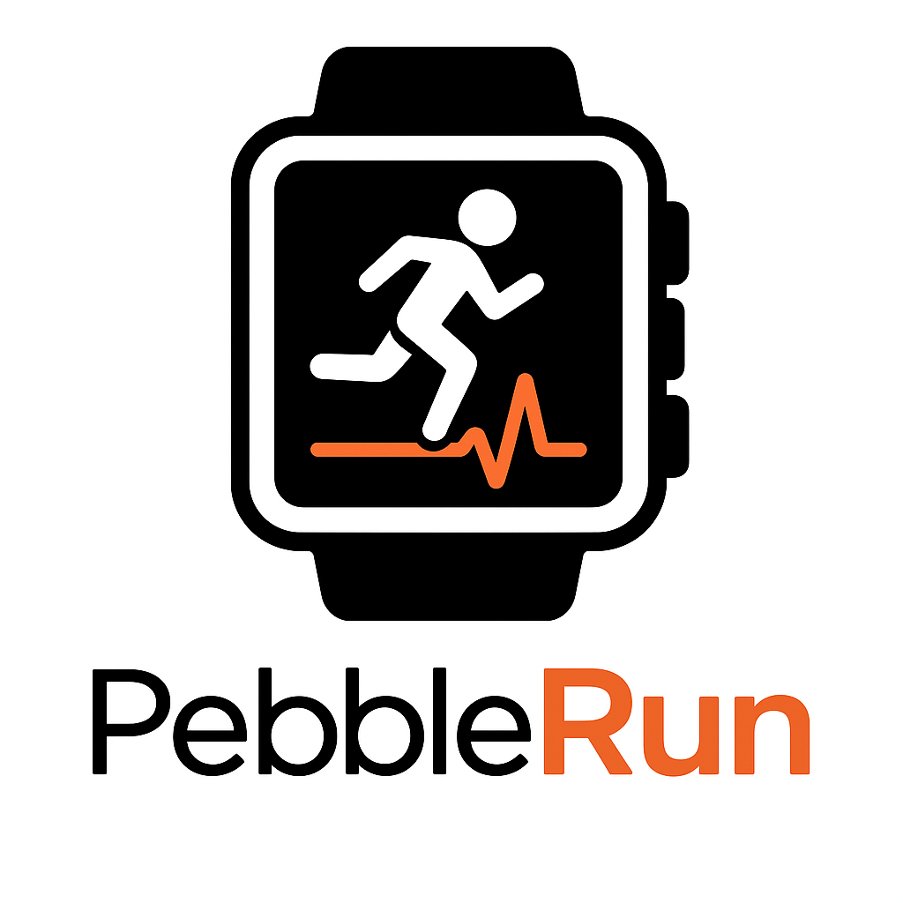

# ⌚ PebbleRun – Pebble 2 HR Companion App

<p align="center">
  
</p>

[](https://kotlinlang.org/)  
[](https://developer.android.com/jetpack/compose)  
[](https://developer.apple.com/xcode/swiftui/)  
[](https://developer.rebble.io/docs/)  

> **PebbleRun** is a lightweight **companion app** for Pebble 2 HR.  
> Track **Heart Rate, Pace, and Duration** on both your Pebble watch and your phone.  
> Built with **Kotlin Multiplatform**, **Android Compose**, **iOS SwiftUI**, and a custom **Pebble watchapp**.

---

## 🚀 Features
- **Start/Stop sessions** directly from mobile app  
- **Auto-launch PebbleRun watchapp** when a workout starts  
- **Real-time sync**:  
  - Pebble → Phone: Heart Rate  
  - Phone → Pebble: Pace + Time  
- **Background tracking** (Android Foreground Service, iOS Background Modes)  
- **Local storage** with SQLDelight (future Strava integration)  

---

## 🏗️ Architecture
Minimal **Clean Architecture** with Kotlin Multiplatform backbone:

```
pebble2hr/
├─ apps/
│  ├─ androidApp/          # Android (Compose, ViewModels, DI)
│  ├─ iosApp/              # iOS (SwiftUI, DI, bridging flows)
│  └─ pebble-watchapp/     # Pebble C SDK (PebbleRun)
│
├─ shared/
│  ├─ domain/              # Entities, UseCases, Repository interfaces
│  ├─ data/                # Repository implementations, Mappers, Infra
│  ├─ bridge-pebble/       # expect/actual for PebbleKit
│  ├─ bridge-location/     # expect/actual for GPS providers
│  ├─ storage/             # SQLDelight schemas
│  ├─ proto/               # AppMessage keys & DTOs
│  └─ util/                # Utils (logger, formatters)
```

- **Domain** = pure Kotlin (no platform deps).  
- **Data** = infra + bridges + storage.  
- **Apps** = UI, DI, lifecycle only.  

---

## 🔌 AppMessage Protocol

| Key | Name  | Type   | Example    |
|-----|-------|--------|------------|
| 0   | PACE  | string | `"5:30/km"`|
| 1   | TIME  | string | `"00:12:45"`|
| 2   | HR    | int    | `145`      |
| 3   | CMD   | byte   | `1=START` / `2=STOP` |

---

## 🧪 Testing
- **Unit tests**: domain use cases (pace calc, HR avg, session transitions).  
- **Integration tests**: repositories with in-memory SQLDelight, fake Pebble bridge.  
- **Platform tests**: Android Foreground Service, iOS CoreLocation bridging.  
- **Watchapp tests**: Pebble emulator + manual HR validation.  

---

## 📋 Roadmap
- [x] MVP: Android + iOS apps, PebbleRun watchapp, local storage  
- [ ] Strava integration (GPX/FIT uploads)  
- [ ] HR & pace charts in mobile app  
- [ ] Training plans + AI coaching  

---

## 🤝 Contributing
We welcome contributions! Please follow:
- [Kotlin Coding Conventions](https://kotlinlang.org/docs/coding-conventions.html)  
- Repo-wide & path-specific [Copilot Instructions](.github/)  
- Clean Architecture boundaries (see [PRD](pebble2hr_prd_updated.md))  
- Add tests for all non-trivial changes  

---

## 📸 Screenshots (TBD)
_Add screenshots of PebbleRun watchapp & mobile UI here._

---

## 📜 License
MIT © 2025 PebbleRun Contributors
